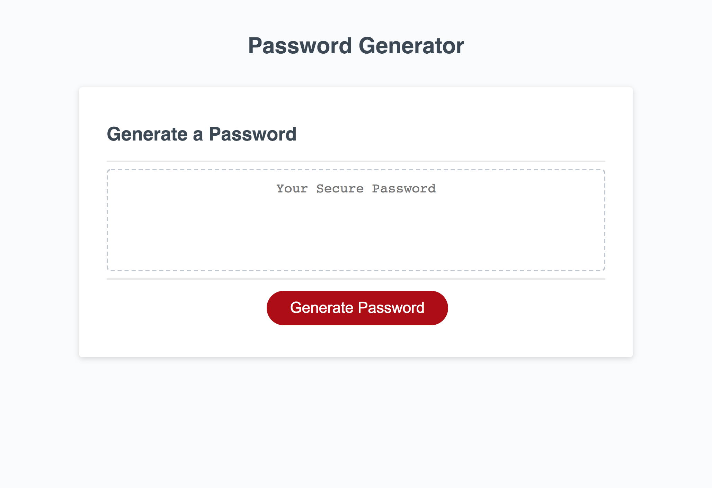

# Randome Password Generator

## Purpose
A website that creates a random password based on selected password length and seclected character types.

## Built With 
HTML, CSS, and JavaScript

## Website

## Screenshot

